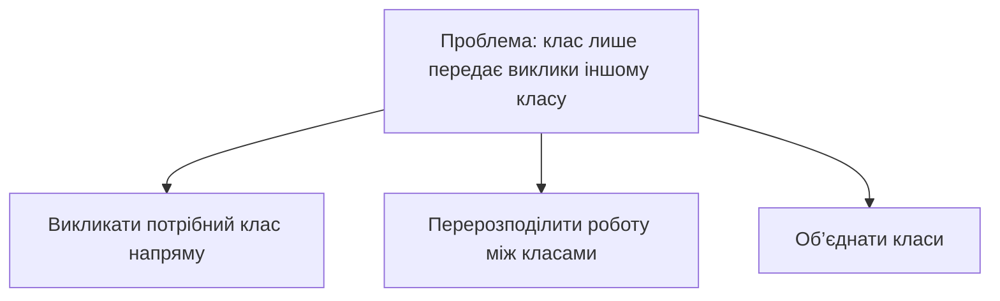

# Різні шари — різні абстракції

## Головна ідея

**Кожен шар програми має брати на себе роботу, яка спрощує використання наступного шару.** Шар — це частина програми, що користується іншою частиною. Абстракція — спосіб працювати з нею, не знаючи всіх внутрішніх деталей.

Наприклад, редактор просить: «встав цей текст у вказане місце». Модуль тексту сам визначає, які рядки розділити та з’єднати. Редактор працює з дією користувача, а модуль — із правилами зміни тексту.

^aphsd-ch07-main-idea

## 1. Посередник має додавати користь

Уявімо два класи: `Editor` керує редактором, а `Document` зберігає та змінює текст. Якщо метод редактора лише повторює виклик документа:

```typescript
// Метод усередині Editor; document — об’єкт Document.
insert(text: string, position: number): void {
  this.document.insert(text, position);
}
```

…то він не додає власної роботи. Такий метод називають **pass-through method** — метод-посередник. Якщо змінити параметри `Document.insert`, доведеться змінити й обгортку в `Editor`.

^aphsd-ch07-pass-through

Спрощення ідеї рисунка 7.1:



Це три альтернативи. Прямий виклик підходить, якщо посередник зайвий; перерозподіл — якщо кожен клас може мати чітку власну роботу; об’єднання — якщо розділення не дає користі.

^aphsd-ch07-figure-7-1

**Саме делегування не є помилкою.** Наприклад, маршрутизатор теж передає запит далі, але спочатку вибирає обробник: `/users` — одному, `/orders` — іншому. Він додає корисне рішення. Так само два класи можуть мати метод `save`, але один зберігатиме у файл, а інший — у базу даних. Однакові назви й параметри не роблять їх зайвими.

^aphsd-ch07-interface-duplication

## 2. Декоратор теж має виправдовувати свою ціну

**Декоратор — обгортка, яка додає поведінку, зберігаючи той самий спосіб виклику.** Наприклад, відправник має метод `send(message)`. Обгортка з таким самим методом спочатку записує повідомлення в журнал, а потім викликає відправника.

Це корисна робота. Але якщо заради одного доповнення обгортка повторює десятки інших методів, вона може ускладнити програму. Варто перевірити, чи простіше додати цю поведінку до наявного класу або конкретного місця використання.

^aphsd-ch07-decorators

Приклади TypeScript та порядок обгорток: [[02-Concepts/concept-decorator-wraps-behavior|нотатка про декоратори]].

## 3. Інтерфейс не має перекладати внутрішню роботу на клієнта

Повернімося до модуля тексту. Усередині він зберігає масив рядків. Користувач хоче видалити фрагмент, який починається в одному рядку й закінчується в іншому.

- **Незручно:** модуль дозволяє лише читати та замінювати цілі рядки. Редактор сам обрізає два рядки, видаляє проміжні та склеює залишки.
- **Зручно:** модуль має `delete(start, end)` і сам виконує всі ці кроки.

Зберігання не змінилося, але інтерфейс приховав складність. Саме так шар додає корисну абстракцію.

^aphsd-ch07-interface-implementation

## 4. Не змушуй методи переносити чужі налаштування

Припустімо, під час запуску програми задається сертифікат для захищеного з’єднання. Якщо його передають через п’ять методів, а використовує лише останній, інші чотири отримують зайвий параметр. Це **pass-through variable** — змінна, яку лише передають далі.

^aphsd-ch07-pass-through-variables

Один із варіантів — **контекст**, об’єкт зі спільними налаштуваннями одного екземпляра програми. Об’єкт, що відкриває з’єднання, отримує контекст у конструкторі й зберігає посилання на нього. Його методи беруть сертифікат звідти, тож передавати його в кожному виклику вже не потрібно.

Контекст також має ціну: залежності стають менш помітними, а сам він може розростися. Тому це компроміс, а не обов’язкове рішення для кожного параметра. Незмінні налаштування простіше безпечно використовувати спільно.

^aphsd-ch07-context

Докладніше: [[01-Sources/books/a-philosophy-of-software-design/03-Concepts/concept-shared-settings|Спільні налаштування без передачі через кожен метод]].

## Запитання для перевірки дизайну

**Яку роботу більше не потрібно робити решті програми завдяки цьому класу або методу?** Якщо відповіді немає, можливо, цей елемент зайвий.

## Джерело та зв’язки

- [[01-Sources/books/a-philosophy-of-software-design/A Philosophy of Software Design|A Philosophy of Software Design]], розділ 7. Приклади спрощено для цієї нотатки.
- [[01-Sources/books/a-philosophy-of-software-design/03-Concepts/deep-modules-hide-complexity|Глибокі модулі приховують складність]]
- [[01-Sources/books/a-philosophy-of-software-design/02-Chapters/ch-06-general-purpose-modules-are-deeper|Розділ 6. Модулі загального призначення є глибшими]]
