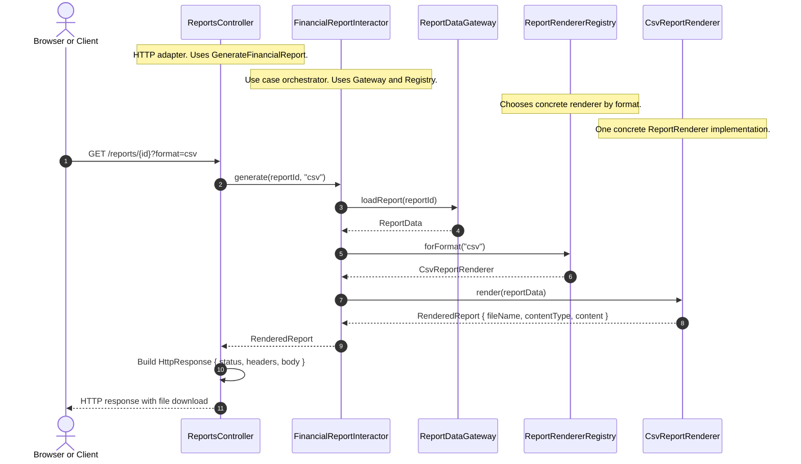

# CSV-експорт фінансового звіту через SOLID

## Фрагмент

Уявімо запит на фічу: система вміє показувати фінансовий звіт у web-інтерфейсі, і продуктова команда просить додати `CSV export`, щоб фінансовий відділ міг вивантажувати дані в Excel. Спершу фіксуємо policy: use case має "зібрати дані звіту і відрендерити їх у вибраному форматі".

```typescript showLineNumbers
// Десятковий рядок зберігає точність суми з БД, наприклад "1234.56".
// У цьому сценарії суму лише передаємо й форматуємо, не обчислюємо.
type DecimalAmount = string;

type ReportData = Readonly<{
  title: string;
  revenue: DecimalAmount;
}>;

type RenderedReport = Readonly<{
  fileName: string;
  contentType: string;
  content: Uint8Array;
}>;

interface ReportDataGateway {
  loadReport(reportId: string): Promise<ReportData>;
}

interface ReportRenderer {
  render(data: ReportData): RenderedReport;
}

interface ReportRendererRegistry {
  forFormat(format: string): ReportRenderer;
}

interface GenerateFinancialReport {
  generate(reportId: string, format: string): Promise<RenderedReport>;
}

type ReportRow = Readonly<{
  title: string;
  revenue: DecimalAmount;
}>;

// Адаптер драйвера повертає один рядок або відхиляє Promise,
// якщо звіт не знайдений чи запит завершився помилкою.
interface PostgresClient {
  querySingle(sql: string, params: readonly string[]): Promise<ReportRow>;
}

class FinancialReportInteractor implements GenerateFinancialReport {
  constructor(
    private readonly gateway: ReportDataGateway,
    private readonly renderers: ReportRendererRegistry,
  ) {}

  async generate(reportId: string, format: string): Promise<RenderedReport> {
    const data = await this.gateway.loadReport(reportId);
    const renderer = this.renderers.forFormat(format);
    return renderer.render(data);
  }
}

// Реалізації форматування тут опущені: кожна повертає UTF-8 байти.
// HTML-адаптер екранує текст, CSV-адаптер обробляє роздільники й лапки.
declare function renderHtml(data: ReportData): Uint8Array;
declare function renderCsv(data: ReportData): Uint8Array;

class HtmlReportRenderer implements ReportRenderer {
  render(data: ReportData): RenderedReport {
    return {
      fileName: "report.html",
      contentType: "text/html; charset=utf-8",
      content: renderHtml(data),
    };
  }
}

class CsvReportRenderer implements ReportRenderer {
  render(data: ReportData): RenderedReport {
    return {
      fileName: "report.csv",
      contentType: "text/csv; charset=utf-8",
      content: renderCsv(data),
    };
  }
}

class PostgresReportDataGateway implements ReportDataGateway {
  constructor(private readonly postgres: PostgresClient) {}

  async loadReport(reportId: string): Promise<ReportData> {
    const row = await this.postgres.querySingle(
      "select title, revenue from reports where id = $1",
      [reportId],
    );
    return { title: row.title, revenue: row.revenue };
  }
}

class InMemoryReportRendererRegistry implements ReportRendererRegistry {
  constructor(private readonly renderers: ReadonlyMap<string, ReportRenderer>) {}

  forFormat(format: string): ReportRenderer {
    const renderer = this.renderers.get(format);
    if (!renderer) {
      throw new Error(`Unsupported format: ${format}`);
    }
    return renderer;
  }
}

type HttpResponse = Readonly<{
  status: number;
  headers: Readonly<Record<string, string>>;
  body: Uint8Array;
}>;

class ReportsController {
  constructor(private readonly generateFinancialReport: GenerateFinancialReport) {}

  async download(reportId: string, format: string): Promise<HttpResponse> {
    const report = await this.generateFinancialReport.generate(reportId, format);
    return {
      status: 200,
      headers: {
        "Content-Type": report.contentType,
        "Content-Disposition": `attachment; filename="${report.fileName}"`,
      },
      body: report.content,
    };
  }
}

// Composition root: конкретний клієнт БД надходить із запуску застосунку.
function createReportsController(postgresClient: PostgresClient): ReportsController {
  const gateway = new PostgresReportDataGateway(postgresClient);
  const registry = new InMemoryReportRendererRegistry(
    new Map<string, ReportRenderer>([
      ["html", new HtmlReportRenderer()],
      ["csv", new CsvReportRenderer()],
    ]),
  );
  const useCase = new FinancialReportInteractor(gateway, registry);
  return new ReportsController(useCase);
}

// HTTP-сервер передає результат download у відповідь браузеру.
// Це інфраструктурні залежності, реалізації яких у прикладі опущені.
declare const postgresClient: PostgresClient;
declare function sendToBrowser(response: HttpResponse): void;

async function main(): Promise<void> {
  const controller = createReportsController(postgresClient);
  const response = await controller.download("report-42", "csv");
  sendToBrowser(response);
}
```

^snippet



## Пояснення

Зверху оголошені контракти (`ReportDataGateway`, `ReportRenderer`, `ReportRendererRegistry`, `GenerateFinancialReport`), нижче йдуть concrete-реалізації, а в самому кінці `createReportsController` збирає все докупи. Читання з БД асинхронне, тому `Promise` проходить через gateway, interactor і controller; форматування вже завантажених даних лишається синхронним. `Readonly` обмежує присвоєння полям на рівні типів, але не робить `Uint8Array` незмінним під час виконання.

`declare` описує типи залежностей, реалізації яких опущені, а не створює їх. Для запуску потрібні функції форматування, адаптер драйвера Postgres і HTTP-сервер; сервер також перетворює помилки на HTTP-відповіді. `main` показує один виклик сценарію. Грошова сума передається десятковим рядком без втрати точності; для арифметики потрібна окрема точна модель, а не перетворення на `number`.

Кожен принцип проявляється так:

- `SRP`: `FinancialReportInteractor` оркеструє use case, `PostgresReportDataGateway` читає дані, `CsvReportRenderer` відповідає за формат, а `ReportsController` за HTTP. У кожного модуля свій актор змін.
- `OCP`: щоб додати `XLSX`-експорт, ми створюємо `XlsxReportRenderer` і реєструємо його на периферії. Ядро use case не треба переписувати.
- `LSP`: `HtmlReportRenderer`, `CsvReportRenderer` і майбутній `XlsxReportRenderer` повертають один і той самий контракт `RenderedReport`. Клієнт не повинен знати, який саме renderer стоїть за цим.
- `ISP`: `ReportsController` залежить від вузького `GenerateFinancialReport`, а не від товстого `ReportsService`, де поруч живуть `deleteReport`, `reindexReports` та інші непотрібні операції.
- `DIP`: interactor залежить від `ReportDataGateway` і `ReportRendererRegistry`, а не від `PostgresClient` чи конкретного CSV-класу. Concrete wiring живе в composition root.

Коли приходить наступна вимога ("додайте ще XLSX export"): додаємо `XlsxReportRenderer implements ReportRenderer`, реєструємо його в `ReportRendererRegistry`, додаємо тести, що `GenerateFinancialReport` однаково працює з `html`, `csv` і `xlsx` — і не чіпаємо `FinancialReportInteractor`.

## Ризики або smells

- Поганий перший імпульс на цю ж фічу — один клас `ReportsService` з `if (format === "csv")` поруч із `deleteReport()` і `reindexReports()` — змішує читання з Postgres, вибір формату, HTTP-відповідь, аудит експорту й admin-методи в одному місці.
- Такий код "здається швидким", але саме він робить наступний формат дорожчим за попередній: підміна реалізації вимагає редагувати той самий `if/else`-ланцюг, ризикуючи зачепити вже працюючі формати.

## Пов'язані концепти

- [[02-Concepts/single-responsibility-means-one-actor|SRP означає одного актора, а не одну дію]]
- [[02-Concepts/open-closed-protects-high-level-policy|OCP захищає high-level policy через ієрархію залежностей]]
- [[02-Concepts/liskov-substitution-preserves-client-behavior|LSP зберігає поведінку клієнта при підстановці]]
- [[02-Concepts/interface-segregation-avoids-dependencies-on-unused-operations|ISP ізолює клієнтів від невикористаних операцій]]
- [[02-Concepts/dependency-inversion|Інверсія залежностей]]
- [[03-Maps/solid-and-clean-architecture-principles|SOLID та принципи Clean Architecture]]

## Пов'язані source notes

- [[01-Sources/books/clean-architecture/02-Chapters/ch-07-single-responsibility-principle|Розділ 7. Принцип єдиної відповідальності]]
- [[01-Sources/books/clean-architecture/02-Chapters/ch-11-dependency-inversion-principle|Розділ 11. Принцип інверсії залежностей]]
- [[04-Playbooks/playbook-solid-in-code|Як дотримуватись SOLID у коді]]
